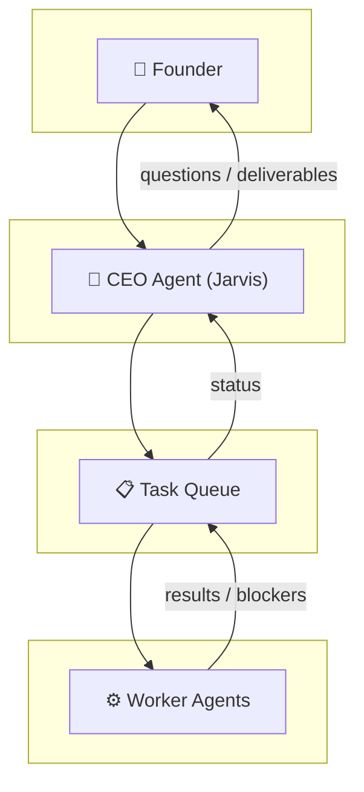
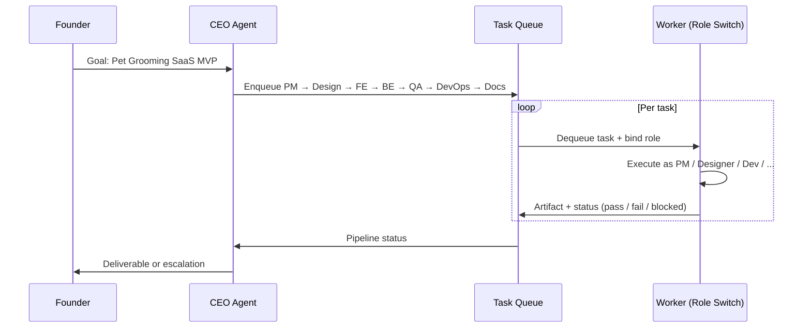

<div align="center">

# 🚀 MurphyX AI Company

**Scaling a 15-person tech startup on a single workstation — optimized for 16GB VRAM** (e.g. **RTX 5060 Ti**) **·** one local model **·** role switching **·** queue-backed execution.

[](README.md)
[](LICENSE)
[](https://python.org)

<br/>

<p align="center">
<sub>
<strong>FRAMEWORK</strong> · <strong>MULTI-AGENT</strong> · <strong>TASK QUEUE</strong> · <strong>ROLE SWITCHING</strong> · <strong>SAAS + CASHFLOW</strong>
</sub>
</p>

</div>

<br/>

<div align="center">

<blockquote>
<p align="left">
<strong>MurphyX</strong> is an experimental <strong>multi-agent AI company framework</strong> that simulates a full tech startup using <strong>role-based agents</strong>.
</p>
<p align="left">
A central <strong>CEO agent ("Jarvis")</strong> orchestrates a team of <strong>specialized workers</strong> — developers, marketers, and operators — through a <strong>task queue</strong> and <strong>role-switching</strong> system.
</p>
<p align="left">
The system is designed to <strong>build and ship SaaS products</strong> while a parallel <strong>cashflow automation layer</strong> supports <strong>operational sustainability</strong>.
</p>
</blockquote>

</div>

<br/>

<div align="center">

──────────────────────────────────────  
**Repository boundary**  
*Trading and pricing playbooks are intentionally not documented in this repository.*  
──────────────────────────────────────

</div>

<br/>

---

## 📑 Table of Contents

- [Architecture](#-architecture)
  - [Architecture Diagram](#architecture-diagram)
  - [Hardware constraints](#hardware-constraints)
- [Agent Runtime System](#agent-runtime-system)
- [Build SaaS Product — pipeline & outputs](#build-saas-pipeline-outputs)
- [Business Engines](#-business-engines)
- [AI Workforce (15 Agents)](#-ai-workforce-15-agents)
- [Tech Stack](#-tech-stack)
- [Repository Structure](#-repository-structure)
- [Getting Started](#-getting-started)
- [Roadmap](#-roadmap)
- [Disclaimer](#️-disclaimer)
- [Support](#-support)

---

## 🧠 Architecture

MurphyX follows a **Human-in-the-loop AI company model**: one human founder at the top, a CEO agent in the middle, and a pool of worker agents at the bottom — all coordinated through a **single task queue** so nothing runs “headless.”

**Founder-in-the-loop, not founder-replaced:** MurphyX isn’t a black box — it’s a tool that **empowers the founder** to make high-level decisions while AI handles the grunt work. Built for **solo entrepreneurs** who want leverage, not a system that pretends to run without them.

<a id="architecture-diagram"></a>
### 1️⃣ Architecture Diagram

**Control flow (top → bottom):**

```text
                    ┌─────────────────┐
                    │     Founder     │  ← Human-in-the-loop (goals, approvals)
                    │     (Human)     │
                    └────────┬────────┘
                             │
                             ▼
                    ┌─────────────────┐
                    │   CEO Agent     │  ← Orchestration, prioritization, delegation
                    │   ("Jarvis")    │     (cloud model — planning & decisions)
                    └────────┬────────┘
                             │
                             ▼
                    ┌─────────────────┐
                    │   Task Queue    │  ← Redis-backed backlog; durable, ordered work
                    │  (Redis / API)  │
                    └────────┬────────┘
                             │
                             ▼
                    ┌─────────────────┐
                    │ Worker Agents   │  ← Same local LLM, different roles per task
                    │ (Role Switch)   │     (time-sliced execution on one machine)
                    └─────────────────┘
```

**Data / responsibility split:**

| Layer | Who | Responsibility |
|-------|-----|----------------|
| **Founder** | Human | Vision, budget, approvals, escalation |
| **CEO Agent** | Cloud LLM | Decompose goals → tasks, assign roles, review outputs |
| **Task Queue** | Infrastructure | Persist tasks, retries, ordering, worker pickup |
| **Worker Agents** | Local LLM | Execute one role at a time; produce artifacts (code, copy, scans) |



Instead of running 15 models at once, MurphyX uses **one local LLM** with **role switching** (see next section) — so a **single workstation** can simulate a full company.

<a id="hardware-constraints"></a>
### Hardware constraints (local-first)

| Target | Why it matters |
|--------|----------------|
| **16GB VRAM** | Sweet spot for running a capable local model **without** multi-GPU or cloud inference for every step. |
| **RTX 5060 Ti class** | Concrete reference hardware — readers know what “one machine” actually means. |
| **Role switching + queue** | **Cost-efficiency:** one loaded model, many roles time-sliced; burst work lands in Redis instead of spawning N chats. |

MurphyX is **tuned for this envelope** so the narrative “15 agents on one box” stays honest for devs who care about **$/token and watts**.

---

<a id="agent-runtime-system"></a>
## 🔄 Agent Runtime System — Role Switching

**Problem:** A real startup has many roles (PM, designer, dev, QA…). Running one chat per role on one machine usually means 15× context, 15× cost, or 15× chaos.

**MurphyX approach:** **One runtime, many roles.** The **Agent Runtime** treats “agent” as **role + task + context**, not as a permanently loaded model.

### How role switching works

1. **Task dequeue** — Worker pulls the next task from the queue (priority, dependencies, retries handled by the queue layer).
2. **Role binding** — Runtime loads **that task’s role**: system prompt, tool allowlist, and optional memory slice (e.g. “SaaS repo summary” for devs; **ops/risk context** for cashflow-engine tasks — *implementation detail stays out of this README*).
3. **Single-tenant execution** — Local LLM runs **as that role only** until the task completes or yields (no parallel **PM** and **Backend** roles in the same forward pass).
4. **Handoff** — Output is written back (PR, doc, outbound artifact, etc.). Next task may be a **different role** — same process, **new system prompt** → **role switch**.

### Why this scales on one workstation

| Without role switching | With role switching |
|------------------------|---------------------|
| N agents ≈ N sessions / N models | N agents ≈ N **prompt profiles** on **1** model |
| VRAM / API cost multiplies | **Time-slicing**: one job at a time, queue absorbs burst |
| Hard to keep one source of truth | **Task queue** is the spine; CEO sees one pipeline |

**Mental model:** *Same actor, different costume per scene* — the LLM is the actor; the **task queue + role prompt** is the wardrobe.

---

<a id="example-workflow-build-saas-product"></a>
<a id="build-saas-pipeline-outputs"></a>
## 📋 Build SaaS Product — pipeline & outputs

One queue, roles switching in order — from goal to **runnable MVP**. Below: **flow → sequence → failure path → repo shape → sample payloads** in one read.

### ① → ⑦ Linear flow (happy path)

```text
Build SaaS Product
──────────────────
  ① PM (Somchai)       → scope, milestones, acceptance criteria
        ↓
  ② UI/UX (Somruedee)  → wireframes, design tokens, screens
        ↓
  ③ Frontend (Saifah)  → Nuxt.js UI against API contract
        ↓
  ④ Backend (Somsak)   → FastAPI + PostgreSQL, auth, core APIs
        ↓
  ⑤ QA (Somjai)        → tests, regression, bug tickets → queue
        ↓
  ⑥ DevOps (Sombat)    → Docker, CI, deploy hooks
        ↓
  ⑦ Tech Writer (Somphop) → README, API docs, runbooks
        ↓
  ✅ Deliverable        → deployable SaaS + docs
```

### Sequence — who drives the queue



### QA fail → re-enqueue (same pipeline)

```text
Somjai (QA) → FAIL → Task Queue → Saifah (FE) / Somsak (BE) → Somjai (re-run)
```

---

### Deliverable shape — what lands in the repo

```text
pet-grooming-saas/
├── README.md                 # product pitch + local run
├── docs/
│   └── api.md                # contract sketch
├── apps/web/                 # Nuxt app shell
│   ├── nuxt.config.ts
│   ├── pages/index.vue       # landing + CTA
│   └── pages/dashboard/      # placeholder routes
├── packages/api/             # FastAPI service
│   └── main.py               # health + 1–2 core endpoints
├── docker-compose.yml
└── .github/workflows/ci.yml  # lint/test gate
```

---

### Sample task payloads (queue result shape)

**After ① — PM (Somchai)**

```text
Task: Draft acceptance criteria for MVP slice
────────────────────────────────────────────────────────────
• User can sign up and create a salon profile
• User can add at least one pet + owner record
• Calendar shows one week view with blocking
• Export CSV of appointments (basic)
```

**GTM adjacent — B2B Copywriter (Somchok)**

```text
Task: Generate landing page hero + subhead
────────────────────────────────────────────────────────────
"Pet Grooming SaaS built for modern salons — schedule clients,
 track inventory, and get paid without the spreadsheet chaos.
 One dashboard. Zero missed appointments."

CTA primary:   Start free trial
CTA secondary: Book a 15-min demo
```

**After ④ — Backend (Somsak)**

```text
Task: OpenAPI stub for appointments resource
────────────────────────────────────────────────────────────
POST   /api/v1/appointments
GET    /api/v1/appointments?from=&to=
PATCH  /api/v1/appointments/{id}
(auth: bearer — placeholder middleware)
```

---

## 🏢 Business Engines

MurphyX runs **two parallel business engines** — SaaS builds the *empire*; the other engine feeds **cashflow** so the company narrative feels complete (not product-only).

### SaaS Production — *The Empire*

AI-driven SaaS factory:

| Phase | Responsibility |
|-------|----------------|
| Ideation | Product ideas & scope |
| Design | UI/UX |
| Build | Coding & integration |
| Quality | QA testing |
| Ship | Documentation & handoff |

**Initial target:** **Pet Grooming Management SaaS**

---

<a id="cashflow-engine-comtrade-abstract-layer"></a>
### Cashflow Engine — *ComTrade (abstract layer)*

> **Disclosure strategy:** Mention ComTrade in the **abstract** so the repo still reads as an *AI company with a cashflow engine* — without publishing **trading strategy, channels, or pricing logic** (reduces copy-paste cloning of the business model).

What you *can* say without opening logic:

| Layer (abstract) | What it means (high level) |
|------------------|----------------------------|
| **Market intelligence engine** | Signal / opportunity surfacing — *sources and ingestion methods not specified here* |
| **Automation trading engine** | Policy-driven automated execution — *policies and parameters not disclosed* |
| **Secondary market arbitrage** | Strategic lens (buy low / sell spread) — *no asset class or supply-chain detail* |
| **Cashflow automation** | Objective is **recurring cashflow** to support the SaaS pipeline — *no numbers or playbook in public docs* |

**Goal:** MurphyX should feel like a **startup with a real cashflow engine**, not just an app repo — while keeping **implementation depth off the public README**.

---

## 👥 AI Workforce (15 Agents)

All MurphyX agents follow a Thai **“Som-”** naming convention — a small cultural joke meaning *if you have a problem, there is always another Som to handle it.*

In MurphyX, the entire startup workforce just happens to be named **Som-something**. Coincidence? Probably not.

### 💻 SaaS Production

| Agent | Role |
|-------|------|
| Somchai | Project Manager — turns chaos into Jira tickets |
| Somruedee | UI/UX Designer — makes things look expensive |
| Saifah | Frontend Developer — pixels, states, and CSS battles |
| Somsak | Backend Architect — APIs, databases, and mysterious bugs |
| Somjai | QA Engineer — professionally breaks everything |
| Sombat | DevOps / SRE — keeps the servers alive at 3 AM |
| Somphop | Technical Writer — turns developer pain into documentation |

### 🚀 Go-To-Market

| Agent | Role |
|-------|------|
| Somjit | Growth Marketer — finds users where nobody looked |
| Somchok | B2B Sales Copywriter — converts confusion into revenue |
| Somporn | Customer Success — keeps customers happy and calm |

### 💰 Cashflow Engine (ComTrade)

Parallel **cashflow** roles only here — the **abstract layers** (market intelligence engine, automation trading engine, secondary market arbitrage, cashflow automation) live in **one place:** [Business Engines → Cashflow Engine](#cashflow-engine-comtrade-abstract-layer). Read that section for the full disclosure-boundary story; this table stays a short roster.

| Agent | Role (short) |
|-------|----------------|
| Sompong | Market intelligence — opportunity surfacing |
| Somkid | Execution economics — internal only |
| Somkiat | Integrity & risk — policy surface |
| Somrit | Outbound listings — format / presentation |

### 📊 Back Office

| Agent | Role |
|-------|------|
| Sommai | CFO — counts the money and occasionally asks uncomfortable questions |

> **MurphyX internal rule:**  
> If Somchai can't fix it, ask Somsak.  
> If Somsak can't fix it, ask Sombat.  
> If Sombat can't fix it… restart the container.

---

## ⚙️ Tech Stack

**Core (MurphyX runtime)**

| Layer | Stack |
|-------|--------|
| Runtime | Python 3.12 |
| LLM | Local LLM (Ollama / vLLM) |
| Queue | Redis |
| API | FastAPI |
| Automation | Playwright (browser automation) |
| Deploy | Docker |

**Frontend SaaS**

| Layer | Stack |
|-------|--------|
| App | Nuxt.js + TypeScript |
| Data | PostgreSQL |

---

## 📂 Repository Structure

```text
murphyx-ai-company/
├── agents/          # Role-based agent definitions
├── workflows/       # Multi-step company workflows
├── prompts/         # System & role prompts
├── core/            # Orchestration & queue
├── services/        # Integrations (automation, APIs)
├── docs/            # Deep dives & ADRs
└── examples/        # Runnable demos
```

---

## 🛠 Getting Started

> **Coming soon.**  
> MurphyX is under **active development**.

```bash
# Clone (when public)
git clone https://github.com/your-org/murphyx-ai-company.git
cd murphyx-ai-company

# Setup steps will be added here
```

---

## 🗺 Roadmap

| Milestone | Description |
|-----------|-------------|
| ⬜ | AI Agent Router |
| ⬜ | Role Switching Engine |
| ⬜ | SaaS Factory Workflow |
| ⬜ | Cashflow / market-intelligence pipeline (implementation private) |
| ⬜ | Autonomous Startup Simulation |

---

## ⚠️ Disclaimer

MurphyX is an **experimental research project** exploring **AI-driven startup automation**.

**Open-source boundary:** architecture, agent model, and SaaS workflows are documented here; **proprietary execution logic** for any cashflow/automation engine is intentionally **not** disclosed in this repo.

Use responsibly. No warranty; not financial or legal advice.

---

## ⭐ Support

If this project resonates with you, **star the repo** — it helps a lot.

<div align="center">

**Built with curiosity — MurphyX AI Company**

</div>
