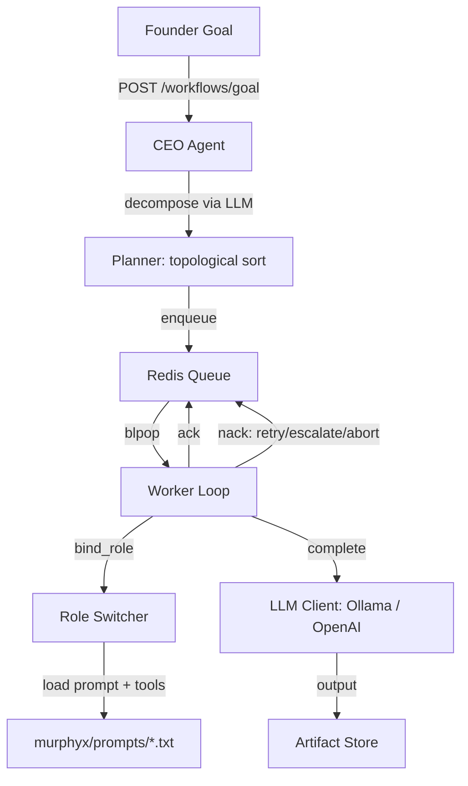

# Architecture

Human-in-the-loop: CEO agent -> task queue -> worker agents (role switching). No trading/pricing playbooks in this repo.

---

## Runtime data flow

## Key components

| Component | File | Responsibility |
|-----------|------|----------------|
| Settings | `murphyx/config.py` | pydantic-settings, env-only config |
| Task schema | `murphyx/queue/task_schema.py` | Pydantic V2 TaskEnvelope with lineage |
| Queue | `murphyx/queue/redis_queue.py` | Async enqueue/dequeue/ack/nack |
| LLM client | `murphyx/services/llm_client.py` | httpx async, Ollama + OpenAI compat |
| Role switcher | `murphyx/runtime/role_switcher.py` | Prompt loading, tool allowlist |
| Worker loop | `murphyx/runtime/worker_loop.py` | Consumer loop with failure policy |
| Agent runtime | `murphyx/runtime/agent_runtime.py` | Facade: start, run_task, shutdown |
| Task router | `murphyx/orchestrator/task_router.py` | task.type -> role_id mapping |
| Planner | `murphyx/orchestrator/planner.py` | Topological sort, workflow versioning |
| CEO agent | `murphyx/orchestrator/ceo_agent.py` | LLM goal decomposition -> task list |
| Tools | `murphyx/tools/` | Sandboxed tools with Pydantic schemas |
| Observability | `murphyx/observability/` | Structured JSON logging |
| Artifact store | `murphyx/services/artifact_store.py` | Per-task output directories |

---

## Pillar 1 — Consumer loops and router (long form)

A **consumer loop** that waits for work will use `while True` (or async equivalent) to **dequeue** — banning that outright forces awkward workarounds.

**Best practice:** Control flow lives in the **Router/FSM** (LangGraph-style edges). After each task completes, a **router function** decides the next state — for example:

- `somjai_qa` finishes -> if `bug_found` route to `somsak_backend` with error context; else route to `sombat_devops`.

Same idea as microservices: **the loop only consumes; the router decides.**

**Implementation:** Explicit states (`DRAFTING`, `QA_TESTING`, `REVISION`, `APPROVED`); router evaluates outputs and returns the next node — no long if/else chains inside the worker loop body.

---

## Pillar 2 — No torch.cuda in our layer

If inference runs through **Ollama or vLLM**, VRAM is managed inside that engine (load/unload via API). Calling `torch.cuda.empty_cache()` in our Python process does nothing useful.

Use **context isolation** and engine APIs instead — see `.cursorrules` Pillar 2.

---

## Pillar 3 & 4 — Debate and judge (when to use)

Debate and LLM-as-judge are **expensive**. Use them only when the router marks a node as high-stakes or critical; routine steps should not pay that cost every time.

---

## ADR: Stateless agents over persistent memory

**Decision:** Agents treat every task as an isolated execution. No in-process globals or caches carry state between dequeues.

**Rationale:** Stateful agents create hidden coupling between tasks. Bugs become non-reproducible when state leaks. With a single LLM serving multiple roles via time-slicing, leftover context from one role would contaminate the next.

**Consequence:** Any data an agent needs across tasks must be explicitly read from storage (queue, DB, artifact store).

## ADR: Pydantic V2 for all schemas

**Decision:** TaskEnvelope, tool I/O, API models, and Settings all use Pydantic V2 BaseModel.

**Rationale:** Runtime validation catches malformed LLM output early. `model_dump_json()` / `model_validate_json()` provide zero-config serialization for Redis round-trips.

## ADR: Single queue with role switching

**Decision:** One Redis list (`murphyx:tasks`) with role_id per task, rather than one queue per agent.

**Rationale:** With a single local LLM, multiple queues create contention without parallelism gains. A single queue + role switcher keeps the architecture simple and lets the worker process tasks in FIFO order regardless of role.
