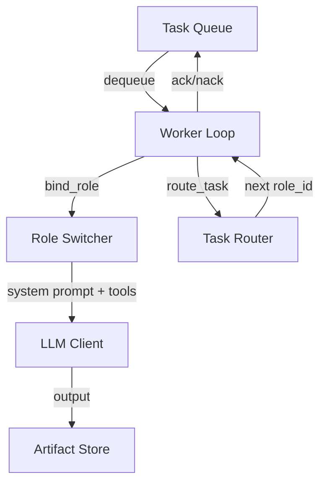
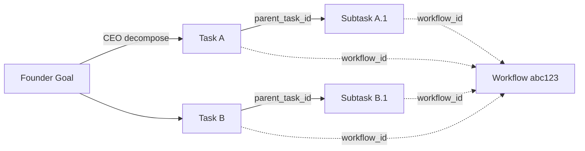
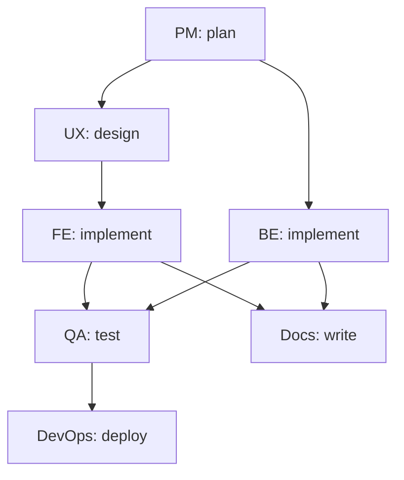

# Workflow design

## Router / FSM pattern

Control flow in MurphyX follows a Router/FSM model (Pillar 1 in `.cursorrules`). The worker loop only dequeues; the router decides what happens next.

## Task lineage

Every task carries lineage fields for traceability:

Fields: `task_id`, `parent_task_id`, `workflow_id`, `workflow_version`.

## Build SaaS workflow graph

## Failure handling

Each task declares a `FailurePolicy`:

- **retry** — re-enqueue up to `max_retries` times
- **escalate** — move to dead-letter queue for human review
- **abort** — stop the workflow immediately

The worker loop applies this policy automatically on task failure.

## Versioning

Workflows set `workflow_version` on all tasks they produce. When you change a workflow's task structure, bump the version so workers can distinguish old-format tasks from new ones.
